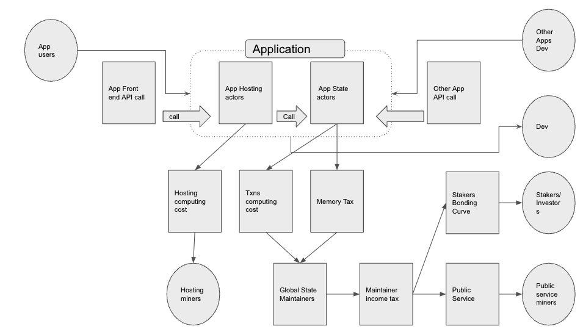

# harberger_tax pages

* [API billing model](API_billing_model.md)
* [API user billing model](App_User_billing_model.md)
* [Computing resource billing model](Computing_resource_billing_model.md)
* [Global bonding curve](Global_bonding_curve.md)
* [Global CML](maintainer_tax.md)
* [Global pool](/epoch10_billing_tax/Collection_Pool.md)
* [Global state maintainer nodes](Global_state_maintainer_nodes.md)
* [Hosting service billing tax](hosting_service_billing_tax.md)
* [How to set memory tax rate](how_to_set_memory_tax_rate.md)
* [Maintainer income tax](maintainer_tax.md)
* [Memory bonding curve](memory_bonding_curve.md)
* [Memory tax billing model](Memory_tax_billing_model.md)
* [Pre-mined](pre_mined.md)
* [Self-estimated price](self_estimate_price.md)
* [Txns computing cost](Txns_computing_cost.md)
* [Txns computing fee](Txns_computing_fee.md)
* [Public service cost / maintainer tax](What_if_public_service_cost_run_off_maintainer_income_tax.md)

# TEA Tokenomic rules

## No free lunch rule

As a decentralized system, there is no free lunch. Running every single line of code will consume some sort of computing resource that provided by the miner. Miners must get paid by some one, so do developers. 

The goal of TEA Project is to provide a measurable, fair, ecosystem, powered by crypto token and cutting edge economics algorithm. 

## Code is money rule

Code is owned by the developer who deploy it. Developer can decide the price of an API call to his code. It is OK to be free to call, but he still need to pay for the computing resource to the miner.  If he decide to charge a fee, the caller of this API will pay for the call.

Note. In Ethereum, there is no rule to pay developers by using smart contract code. Only gas fee is collected from caller. This is one of the differences. This rule is similar to [Fluence](https://fluence.network/)

## Gas fee during code execution

Like EVM measures smart contract byte code consumption as  "gas", TEA mini-runtime measure the WASM byte code consumption too. 

The provider code is no a wasm code. It will be measured at a flat rate defined by the TEA core team.

The unit of gas in TEA Project is TEA token.

Hosting nodes have OrbitDB/IPFS for temporary or permenance storage. It is also charged based on size * time.

## Memory tax for storage in state machine

All TApps in the TEA Project share a single state machine. All state is stored in the memory of every [Global_state_maintainer_nodes](Global_state_maintainer_nodes.md). Beacuse state memory is a limited resource. We need a [Memory_tax_billing_model](Memory_tax_billing_model.md) to optimize the usage of memory and prevent attacks. 

Every app will need to pay a "memory tax" for the memory it uses for every metering time slot. The tax = tax_rate * storage_size * length_of_time. The tax rate is not a const value, it increases as the remaining memory reduces. 

# App usage and mining cost

End users pay to App devs for usage of the app. More detail [App_User_billing_model](App_User_billing_model.md)
App devs pay to dev of other app's API for usage of that API. More details on [API_billing_model](API_billing_model.md)
App pays to the miner the hosting service fee. More detail [Computing_resource_billing_model](Computing_resource_billing_model.md)
App pays to the [Global_state_maintainer_nodes](Global_state_maintainer_nodes.md) (old name is A-CML miners) the Memory tax. More detail [Memory_tax_billing_model](Memory_tax_billing_model.md)
App pays to the Global state maintiner the txn computing fee. More detail [Txns_computing_fee](Txns_computing_fee.md)
Global miners pay [maintainer_tax](maintainer_tax.md) to the [Distribution_Pool](../epoch10_billing_tax/Distribution_Pool.md)
Global pool split all kinds of tax to public service cost and stakers dividend in bonding curve.
Public sevice pays to all miners(A or B) for public services such as RA.

# Hosting CML seeds auction

Based on supply / demand balance, new hosting CML seeds will be on auction periodically.
New miners bid for the seeds. Pay in TEA.
This fund put into the global income tax pool used for public service and dividend. Original design was burning the fund.

Because the hosting CML has life span. Miners need to periodically buy 
seeds to continue mining. This can continue contribute to the income tax pool , which will suppor the public service cost.
